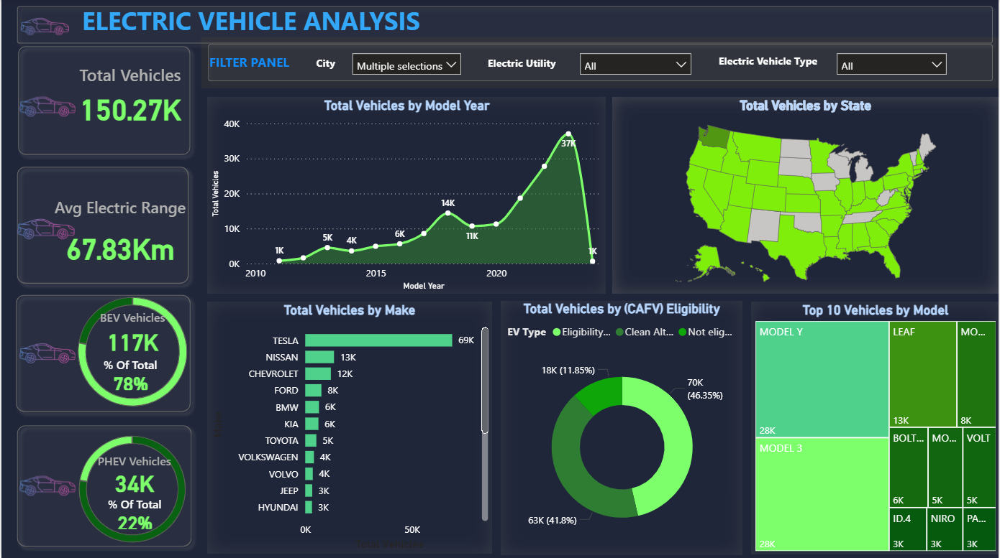

# Electric Vehicle Analysis — Power BI Project

An interactive **Power BI dashboard** analyzing **U.S. electric vehicle (EV) growth**, **state-wise adoption**, **top manufacturers**, **CAFV eligibility**, and **EV model performance**.

---

## 📊 Dashboard preview



> For a quick walkthrough, see: `dashboard_demo.gif`

---

## 📊 Dashboard Demo


---
## 🎯 Project Objectives

- Track **EV adoption trends** across the United States
- Identify **top-performing states** and **leading manufacturers**
- Analyze **CAFV (Clean Alternative Fuel Vehicle) eligibility**
- Compare **EV models** based on key metrics and distribution

---

## 🧰 Tools Used

- **Power BI**
- Dataset (provided in repo): **Electric Vehicle Dataset**

---

## 🚀 How to Use

1. Download the Power BI file:
   - `Electric Vehicle Analysis.pbix`

2. (If needed) Extract the dataset:
   - `Electric Vehicle Dataset.zip`

3. Open the `.pbix` file in **Power BI Desktop**
4. If Power BI asks for the data source path, point it to the extracted dataset files
5. Explore filters/slicers and visuals to generate **insights** interactively

---

## 📄 Requirements / Reference

- `Project Requirements.pdf` contains the project scope and reporting requirements.

---

## 🗂️ Repository Structure

```
.
├── README.md
├── Electric Vehicle Analysis.pbix
├── Electric Vehicle Dataset.zip
├── Project Requirements.pdf
├── dashboard.png
└── dashboard_demo.gif
```

### ⭐ If you found this project helpful , consider giving the repo a **star**!
